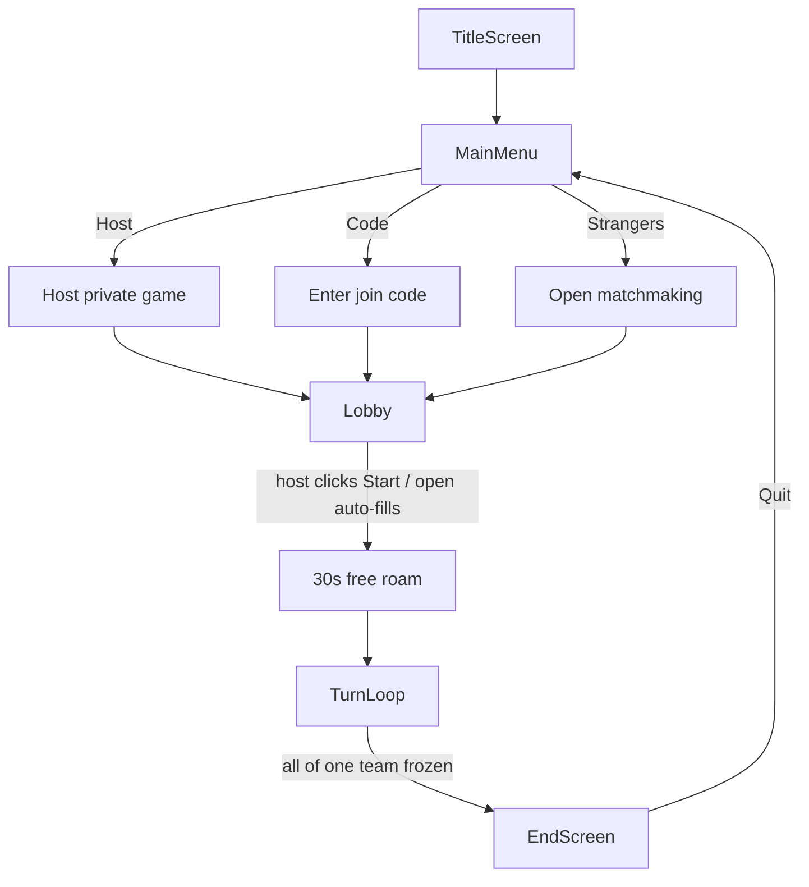
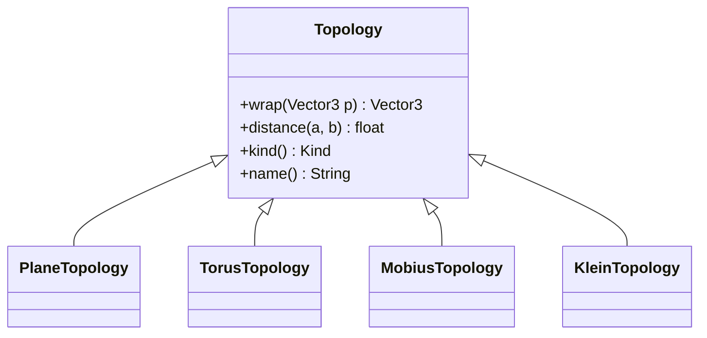
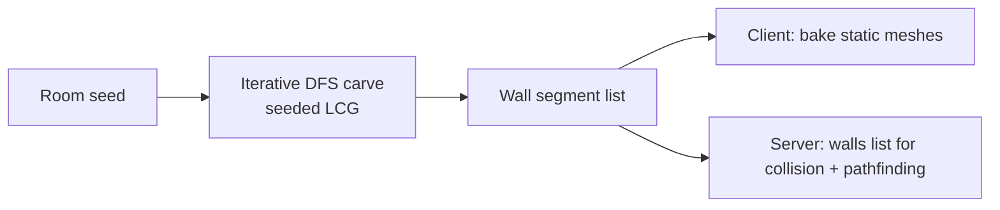
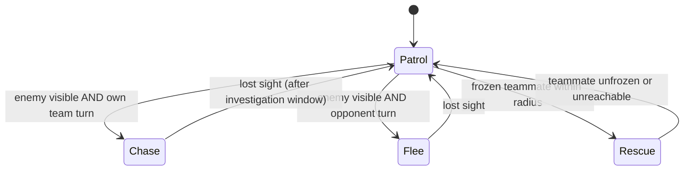
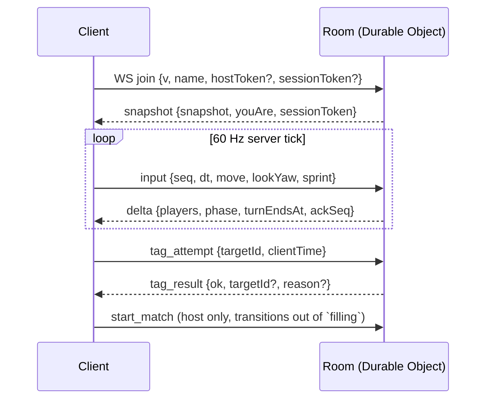
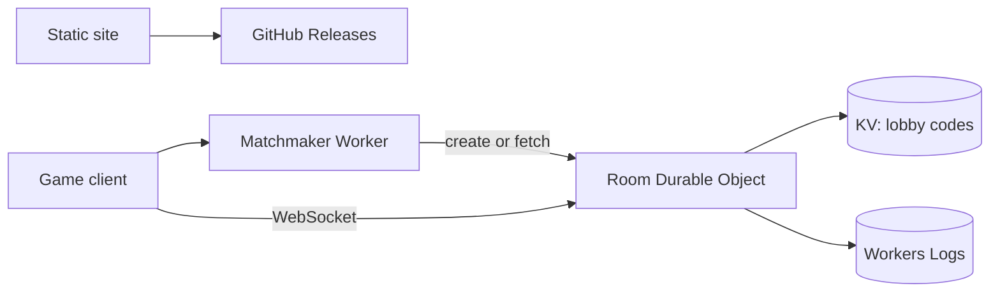
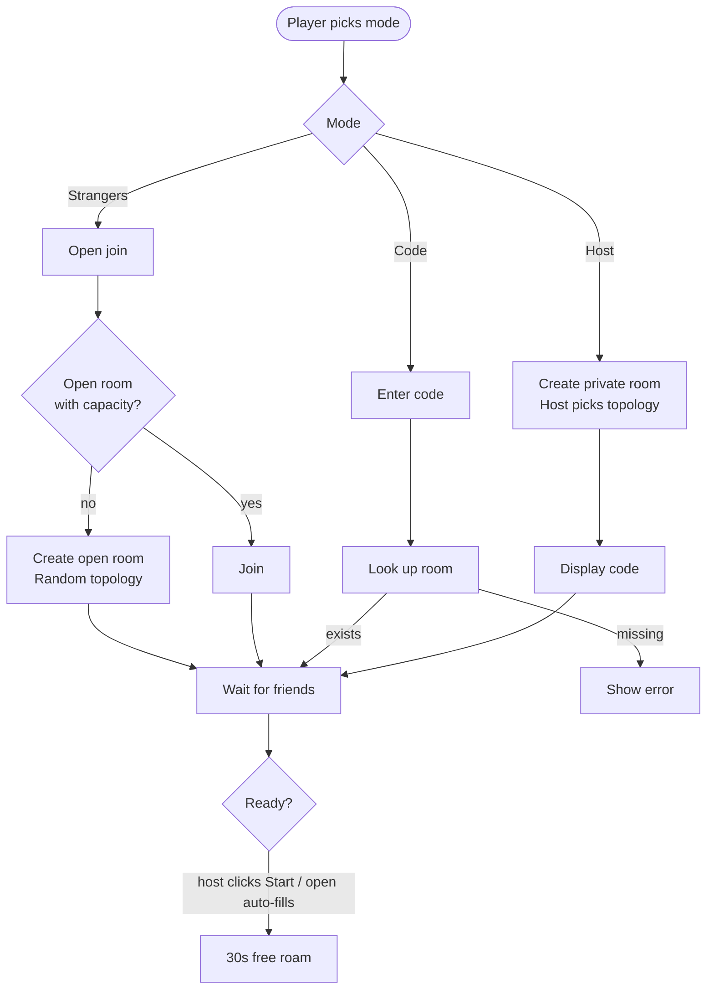
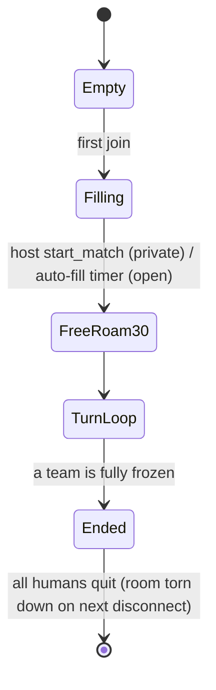
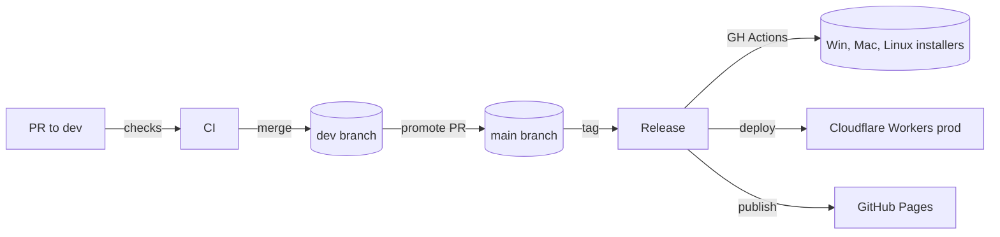

# Architecture

This document is the single source of truth for how the project is built. Other docs are intentionally light and link here for depth.

## Table of contents

- [Goals and constraints](#goals-and-constraints)
- [Technology choices](#technology-choices)
- [Monorepo layout](#monorepo-layout)
- [Game client](#game-client)
- [Topology system](#topology-system)
- [Labyrinth generator](#labyrinth-generator)
- [Audio system](#audio-system)
- [Bot AI](#bot-ai)
- [Networking](#networking)
- [Backend services](#backend-services)
- [Matchmaking](#matchmaking)
- [Room lifecycle](#room-lifecycle)
- [Anti-cheat](#anti-cheat)
- [Website](#website)
- [Build and release pipeline](#build-and-release-pipeline)
- [Environments](#environments)
- [Observability](#observability)
- [Budget](#budget)
- [Open questions](#open-questions)

## Goals and constraints

The game is a 3D team tag game played by 4 to 16 players (humans and bots) on a labyrinth wrapped onto a finite plane, torus, Möbius strip, or Klein bottle. Visibility is intentionally limited. Audio is sparse.

Hard constraints from the project brief:

- Native cross-platform desktop binary. Equal visuals on Windows, macOS, and Linux.
- Installer ships from a website link. No terminal, no scripts, no build from source for end users.
- Backend hosted on Cloudflare. Static site on GitHub Pages.
- Total infrastructure cost under USD 500 per year.
- Open source, MIT license, monorepo on GitHub, conventional commits, atomic commits, PR workflow.

Performance budget per platform:

- Steady 60 FPS on a 2020-class laptop GPU at 1080p.
- Server tick rate of 60 Hz. Client inputs and server deltas both ride that cadence so each server tick drains exactly one client input on average.
- Round-trip latency tolerated up to 200 ms with client prediction + full-replay reconciliation.

## Technology choices

| Layer            | Choice                                        | Reason                                                                                                                                                 |
| ---------------- | --------------------------------------------- | ------------------------------------------------------------------------------------------------------------------------------------------------------ |
| Game engine      | Godot 4 (GDScript primary, C# optional later) | MIT licensed, no royalties, cross-platform desktop export with parity, mature 3D pipeline, small editor footprint, strong async networking primitives. |
| Game language    | GDScript                                      | Fast iteration, no compile step, first-class in Godot, sufficient performance for this game's load.                                                    |
| Backend runtime  | Cloudflare Workers + Durable Objects          | Globally distributed edge compute, native WebSocket hibernation API for low cost, integrated logging, no servers to operate.                           |
| Backend language | TypeScript                                    | Strict typing for protocol safety. Shared types between Workers and tooling.                                                                           |
| Static site      | Astro                                         | Ships zero JS by default, fast, simple, easy to publish to GitHub Pages.                                                                               |
| Test runtime     | Vitest (TS), GUT (Godot), Playwright (web)    | Modern, fast, well-supported.                                                                                                                          |
| CI/CD            | GitHub Actions                                | Free for public repos, mature ecosystem, native to GitHub.                                                                                             |
| Package manager  | pnpm with workspaces                          | Fast installs, disk-efficient, first-class workspace support.                                                                                          |

Alternatives considered:

- Unity: licensing risk and Mac/Linux quirks ruled it out for a small open source game.
- Unreal: oversized for this game's visual scope, large binaries.
- Bevy (Rust): exciting but young; risk to schedule for a multi-platform shipping game.
- Bun on Cloudflare: not yet a first-class Workers runtime.

## Monorepo layout

```
clowns-and-mimes/
  game/                      Godot 4 project
    scenes/                  .tscn files
    scripts/                 .gd files
    assets/                  textures, audio, fonts
    addons/                  vendored Godot plugins (GUT for tests)
    export_presets.cfg       not tracked; generated at build
    project.godot
  backend/
    matchmaker/              Cloudflare Worker entry for matchmaking
    room/                    Durable Object hosting one game room
    shared/                  protocol types shared by both
  website/                   Astro static site
  tests/
    e2e/                     Playwright + headless game smoke checks
  docs/                      Architecture and contributor docs
  .github/
    workflows/               CI and release pipelines
    ISSUE_TEMPLATE/
  pnpm-workspace.yaml
  package.json
  LICENSE
```

## Game client



The game client is structured around scene composition in Godot:

- `main.tscn` is the root that swaps the active screen.
- `title_screen.tscn` plays the title animation and the menu theme.
- `main_menu.tscn` shows host, code, and strangers options plus username entry and a gear icon for settings.
- `lobby.tscn` is the pre-arena screen that surfaces the lobby code (host) or join status (joiner), the live player roster, and the host's Start button.
- `arena.tscn` instantiates a topology, the labyrinth, the HUD, and the in-game menu overlay.
- `hud.tscn` overlays sprint bar, countdown, team status, side log, and frozen overlay.
- `in_game_menu.tscn` is the Esc overlay (Resume / Settings / Quit to main menu).
- `settings_panel.tscn` is the modal opened from the gear icon or the in-game menu: mute music, mute SFX, light-mode arena palette. Persisted to `user://settings.cfg` via the `Settings` autoload.

Autoloads:

- `GameState` holds cross-scene state (mode, username, topology, lobby_code, server_url, host_token).
- `AudioBus` configures the Music / SFX / UI buses at boot and owns the long-lived music player so a track started on the title screen survives scene swaps.
- `Settings` is the player-preferences singleton (audio mutes + light mode) backed by `user://settings.cfg`.
- `UsernameGenerator` produces the adjective-and-noun random names.
- `NetClient` owns the `RoomClient` across scene transitions: the lobby opens the WebSocket and the arena re-uses the same connection, so reconciliation state and the initial snapshot survive the lobby → arena swap.

Player movement is handled by `player.gd`, a `CharacterBody3D` with:

- WASD for translational movement
- Mouse look with capture
- Shift to sprint while sprint energy is above zero
- Space to jump on a deterministic 0.6 s parabolic arc, peak 2 m above hover (clears the 1.4 m tag-overlap threshold). Sprint is orthogonal — holding Shift through a jump preserves sprint and does not drain extra energy. Cooldown is 0.1 s after landing.
- Footstep sound emitter modulated by current planar speed
- Tag and unfreeze fire on contact: when the active turn's team brushes within `CONTACT_RADIUS` (1.4 m) of an eligible opponent or teammate, `tag_attempt` / `unfreeze_attempt` is sent to the server. A 0.15 s per-target cooldown keeps one physics frame from firing the same tag repeatedly; the server's own cooldown is the long gate.

Sprint energy:

- 100 unit pool, 25 units per second drain while sprinting, 15 units per second regen otherwise.
- Sprint hysteresis: once energy depletes to 0 mid-sprint the player drops to walk and stays there until energy regens past an engage threshold, preventing 60 Hz jitter at the 0-energy line.
- Sprint is unavailable while frozen.

## Topology system

The world is represented as a 2D coordinate grid with topology-specific wrapping rules applied to both physics and rendering. This avoids the cost of true curved-surface rendering while keeping the gameplay feel of unusual topology.



| Topology     | Wrap rule                                                                          | Rendering treatment                                                                                                                                                                                                                             |
| ------------ | ---------------------------------------------------------------------------------- | ----------------------------------------------------------------------------------------------------------------------------------------------------------------------------------------------------------------------------------------------- |
| Plane        | No wrap on either axis. Boundary walls in the labyrinth seal the edges.            | None needed.                                                                                                                                                                                                                                    |
| Torus        | X wraps modulo WIDTH, Z wraps modulo WIDTH. Both axes plain modular.               | Remote bodies render at the wrap-equivalent position nearest the local camera via `topology.delta`, so a bot crossing the +Z seam appears at the opposite-side continuation rather than teleporting one world-width away from view.             |
| Möbius strip | X wraps modulo 2 × WIDTH on the cylindrical double cover. Z hard-bounded.          | The fundamental Möbius strip identifies (x, z) ~ (x + L, -z); rendering that flip live looks jarring, so the playfield is the cylindrical double cover and the z-flip becomes traversable space. The x-seam is then plain modular and seamless. |
| Klein bottle | X wraps modulo 2 × WIDTH on the double cover, Z wraps modulo WIDTH. Plain modular. | Same double-cover trick as Möbius along x: the right half of the cover is the z-mirror of the left, so the bottle's orientation flip is realised as traversable space rather than an instantaneous flip on each x-seam crossing.                |

Wrapping is enforced in `Topology.wrap` after every physics step. Both the GDScript and TypeScript implementations share the same canonical math; the GDScript build uses `fposmod` where TS uses the `((v + half) % width + width) % width` idiom, which produce identical values.

Remote-body wrap-nearest rendering lives in `player.gd::_to_camera_nearest_copy`. The local player's body itself does not get the same treatment yet, so a local player who crosses a seam still teleports their camera one world-width to the wrap-equivalent side (tracked as a follow-up). The labyrinth wall meshes also do not yet render neighbor copies past the seam.

## Labyrinth generator

The labyrinth is a topology-aware grid maze. The same generator (mirrored bit-for-bit in `grid_maze.gd` and `backend/shared/src/gridMaze.ts`) runs on client and server from the room's seed, so both sides agree on geometry without ever sending mesh data.



Generation steps:

1. Derive a deterministic seed from the room id.
2. Walk an iterative depth-first carver on a `GRID_RES × GRID_RES` (80×80) grid. The LCG state and neighbor-traversal order are pinned so client and server produce the same carve.
3. The neighbor function is topology-aware: torus and Klein wrap, plane treats out-of-bounds as solid, Möbius is rendered as the cylindrical double cover (wider in x, hard-bounded in z). Klein has its own helper that walks the double-cover seam math directly so the right half of the maze mirrors the left.
4. Emit the residual closed-cell-boundary edges as a `WallSegment[]`. Edges at wrap seams are dropped so the topology folds correctly.
5. Client: bake static mesh segments at `WALL_HEIGHT = 6.0` so the camera can't see over them. Floor and walls are dark gray. The wall list also feeds a topology-aware `AStar2D` graph for offline bot pathfinding.
6. Server: keeps the same `WallSegment[]` for `pointBlockedByWall` (spawn validity) and `pathCrossesWall` (bot LOS + flee planning). The matching `botPathfinder.ts` runs a BFS over a coarser grid for routed flee paths.

A legacy ring-based layout (`_build_ring` / `_add_arc_wall` in `labyrinth.gd`) is retained as dead code for a possible experimental mode but no current topology dispatches to it.

## Audio system

Three audio buses configured at runtime: Music, SFX, UI.

- Title screen plays the oompa main menu loop on the Music bus.
- During gameplay each player has an `AudioStreamPlayer3D` footstep emitter on the SFX bus. The pitch scales with current planar speed (silent below a threshold, ~1.0 for walking, up to ~1.6 for sprinting). Remote players use 3D attenuation so distant steps fade with distance.
- Win plays a maniacal laugh on SFX. Loss plays the womp-womp stinger.
- The arena dims the Music bus once the match ends so the stinger reads cleanly.
- `AssetPaths` is a thin loader that returns null when an asset file is absent, so the game runs without art and sound during development.

## Bot AI

Two implementations, one shape:

- **Client-side BotAI (offline play).** Attached to each bot Player as a `BotAI` node. State machine runs at 5 Hz (`TICK_HZ = 5.0`). Paths are recomputed each decision tick via `Labyrinth.find_path`, which runs an `AStar2D` over the topology-aware grid built in `_connect_neighbors`. The bot aims at the next waypoint instead of straight at the target, falling back to direct steering when no path is found. The 4 states are Patrol, Chase, Flee, Rescue.
- **Server-side bot AI (all rooms, hosted and open).** Lives in the room Durable Object's `simulate` loop alongside `simulateHumans`. The same enum (Patrol / Chase / Flee / Rescue) drives decisions; chase paths are direct + wall-aware, flee paths route via the BFS in `botPathfinder.ts`. The room also tracks investigation memory: when a chase target ducks behind cover, the bot routes to the last seen position for up to 3 s before giving up. `canTag` (line-of-sight + radius) gates every tag attempt, and tagged events are broadcast identically to the human path.



- Visibility is gated by both a topology-aware `distance` threshold and `pathCrossesWall` (line-of-sight), so a bot cannot "see" an enemy through a wall.
- Pathfinding is topology-aware: the offline `AStar2D` graph connects across seams via `_wrap_cell`, and the server-side BFS in `botPathfinder.ts` works on the same coarse grid. The follow-up here is mainly performance / quality of the routed paths, not whether seams are traversed.
- Server-side bots use the same wall-segment list the client renders from (generated from the room seed), so wall collisions and LOS are authoritative.
- Patrol exploration memory: each bot remembers its last 6 patrol targets and rejects new candidates within 10 m of any of them, so wandering bots no longer pace between two adjacent cells.

## Networking

Server-authoritative on movement, freeze state, and turn phase. Movement is client-predicted with full-replay reconciliation.



Wire protocol is JSON over WebSocket with a `t` discriminator on every message and `PROTOCOL_VERSION = 2` (defined in `@cm/shared/protocol`). The room rejects mismatched versions with a `version_mismatch` error and closes the socket with close code 4001. Version 2 carries `position: Vec3` (Y is meaningful for the jump arc) and `jumpStartedAt: number | null` on `PlayerState`, plus a `jump: boolean` rising-edge field on `PlayerInput`.

Message types: `join`, `leave`, `input`, `start_match`, `tag_attempt`, `tag_result`, `unfreeze_attempt`, `unfreeze_result`, `ping`, `pong`, `snapshot`, `delta`, `event`, `error`.

Per-tick cadence:

- Client streams one input per physics frame (`INPUT_TICK_HZ = 60`) with a monotonically increasing seq, queued in `RoomClient._send_queue`. The queue is bounded at 64 entries with FIFO drop so a wedged transport can never let it grow unboundedly.
- Server queues each player's incoming inputs in a small ring (cap 4) and drains exactly one per server tick via `simulateHumans`. Overflow drops the oldest; the queue cap keeps simulation close to live time when a client briefly outpaces the tick.
- Server's `delta` returns `ackSeq` (the last seq actually fed into `stepMovement`) plus authoritative player states and `phase` / `turnEndsAt`.

Reconciliation:

- Client keeps every unacked input in `pending_inputs`. On each delta, it drops inputs whose seq is at or below `ackSeq`, then replays the rest from the server's authoritative position via the shared `Movement.step`. The result becomes the new `_pred_current_xz` end-of-tick target.
- Steady-state, `replayed_pos` matches `_pred_current_xz` exactly (both sides run the same deterministic step). Reconcile only re-anchors the lerp start point when the divergence exceeds a 5 cm threshold; below that, the natural 60 Hz predict-tick cycle absorbs the correction without disturbing the render.
- Remote bodies render at `now − REMOTE_RENDER_DELAY_S` (100 ms) from a per-body snapshot buffer, in `_drive_remote_interp`. The interp runs in `_process` (render rate) so it stays smooth on high-refresh-rate monitors.

Reconnect / session resume:

- Each fresh `join` is answered with a `sessionToken` (UUIDv4) in the snapshot envelope, server-only stored in the room's `sessionTokens` map.
- On a transient WS drop, the arena's reconnect ladder (`RECONNECT_BACKOFF_S = [0.5, 1.5, 3.0]`) reconnects the same `RoomClient` and re-sends `join` with the stashed `sessionToken`. The server matches the token to the existing `PlayerState`, rebinds the new WS to that playerId, and replies with a fresh snapshot. The player resumes mid-match instead of being treated as a fresh join (and the freeze-circumvention guard still rejects token-less mid-match joins).
- The server holds the slot open for `RECONNECT_GRACE_MS = 15 s`. Past that, `finalizeDisconnect` tears the player down and the next ladder attempt receives `match_in_progress`.
- A wedged transport (typical of yanked wifi) is detected by `ERR_OUT_OF_MEMORY` from `send_text`: `RoomClient` closes the socket, clears the queue, and emits `disconnected` so the ladder fires within ~1 s rather than waiting for OS-level TCP keepalive to elapse (~30 s).
- While every human is in grace, the server's per-tick `simulate` body is a no-op and `turnEndsAt` is shifted forward by the pause duration on the first resumed tick. Bots, frozen flags, and the turn clock all preserve where the offline player left them. Multi-human matches keep ticking normally because `activeHumans` is non-zero.

Interest management is light. Rooms cap at 16 players, the full state fits in a small packet.

Client modules:

- `ServerConfig` reads `CLOWNS_MM_URL` from the OS environment first, then a project setting, then falls back to the production matchmaker.
- `MatchmakerClient` issues the three HTTP calls (`POST /lobby`, `POST /lobby/:code/join`, `POST /open/join`) and emits signals with the parsed responses.
- `RoomClient` owns the WebSocket lifecycle, sends `join` / `input` / `tag_attempt` / `unfreeze_attempt` / `ping` / `start_match`, stashes the `sessionToken` from each snapshot, and emits parsed `snapshot` / `delta` / `event` / `error` signals.
- `NetClient` (autoload) wraps `RoomClient` so the same connection survives the lobby → arena scene swap. Lobby opens, arena re-uses; `close()` is called when the player returns to the menu or abandons the lobby.
- Arena consumes those when `GameState.server_url` is set; otherwise the offline rules engine drives the match.

## Backend services



- `matchmaker` Worker exposes:
  - `POST /lobby` creates a private room and returns `{code, roomId, wsUrl, hostToken}`. The matchmaker mints a random `hostToken` and stores it in the KV entry next to `roomId` and `topology`. Only this response surfaces the token; subsequent joiners never see it. The KV entry has a 6 hour TTL.
  - `POST /lobby/{code}/join` reads the KV entry and returns `{roomId, wsUrl}` (deliberately omitting the host token so a joiner cannot claim the host role).
  - `POST /open/join` lists open-room entries by prefix, picks the most populated one under the soft capacity (12), increments its joined counter, and returns its `wsUrl`. Falls back to spinning up a fresh open room with a random topology when no candidate exists.
  - `GET /healthz` for uptime checks.
- `wsUrl` is composed as `wss://<room-worker-name>.<account-subdomain>.workers.dev/ws/{roomId}?topology=<topology>` where `<account-subdomain>` is the account's `*.workers.dev` slug, provided to the matchmaker as the `WORKERS_SUBDOMAIN` env var. The host's URL additionally carries `&host=<hostToken>` so the Room DO can identify the host connection on WS upgrade.
- `room` Durable Object holds room state, broadcasts deltas, drives the 60 Hz tick loop, and runs the server-side bot AI for every room. Uses the WebSocket hibernation API to stay cheap when idle.
- `shared` provides protocol types and topology helpers compiled into both Workers via subpath exports (`@cm/shared`, `@cm/shared/topology`).

## Matchmaking



Open rooms target a soft capacity of 12 humans before opening a fresh room. Once a human joins, the room schedules a 3 second bot-fill timer (`BOT_FILL_DELAY_MS`); when it fires the room fills empty seats up to `TEAM_TARGET = 4` bots per team and transitions straight into free roam, so a solo player never sits in an empty lobby. Private (hosted) rooms skip the auto-fill timer: the room stays in `filling` until the host's `start_match` message arrives, then bots fill the remaining slots and the match begins. At match start, `balanceTeamAssignments` rebalances the human roster across teams (sort by id, alternate) so all five humans never land on the same side.

## Room lifecycle



There is no in-room rematch flow yet. Players Quit out of the end screen and matchmake again from the menu.

Joins arriving after `Filling` are rejected with `match_in_progress` **unless** the client presents a valid `sessionToken` whose matching `PlayerState` is still within the `RECONNECT_GRACE_MS` window, in which case the WS is rebound to the original player and the match resumes. The reject path remains the freeze-circumvention guard against leave-and-rejoin attempts (no token means no resume).

Turn duration progression: round 1 is 30 seconds per team, round 2 is 60 seconds, round 3 is 90 seconds, then +30 each round, capped at 5 minutes (`TURN_FIRST_MS`, `TURN_STEP_MS`, `TURN_CAP_MS` in `room.ts`).

## Anti-cheat

- All state transitions are server-authoritative.
- The server validates tag attempts: distance under threshold, vertical overlap (`|attacker.y - victim.y| < 1.4 m`, so a jumper at peak height evades a grounded opponent), both players alive, attacker not frozen, attacker on the active turn team. The vertical gate is reported back as `tag_result.reason = 'vertical_separation'` so the HUD can surface "out of reach (jumped)".
- Movement deltas exceeding the maximum sprint speed are clamped.
- Clients connect with a build version on the WS `join` payload. Mismatched versions are rejected with `version_mismatch` and a popup pointing at the latest release.
- Private lobbies receive a `hostToken` from the matchmaker on create. Only the host's WS URL carries it (`?host=<token>`) and only that connection is allowed to issue the `start_match` message that transitions the room out of `filling`. Joiners never see the token.

We do not attempt binary anti-tamper. The blast radius of cheating is limited because the server is the source of truth.

## Website

A small Astro site at `website/` deployed to GitHub Pages on every push to `main`.

Pages:

- Home: title, screenshot, install buttons that detect the visitor's OS.
- How to play: rules summary.
- Topologies: short visual explainer for each.
- Credits: assets and acknowledgements.

The install buttons resolve to the latest GitHub release asset by platform using a small client-side fetch against the GitHub API at runtime, with a static fallback.

## Build and release pipeline



CI on every PR runs:

- Lint and format
- Type check
- Unit tests
- Backend integration tests against a Miniflare instance
- Game headless smoke tests via Godot in headless mode
- Build verification of game, backend, and website
- Playwright website tests
- Dependency vulnerability audit

Release on a `v*` tag:

- Build game for Windows, macOS, and Linux in parallel jobs.
- Sign macOS build if signing secrets are configured.
- Publish artifacts to GitHub Releases.
- Deploy `backend/*` to the matching Workers environment.
- Deploy website to GitHub Pages.

## Environments

| Environment | Branch | Backend                                  | Frontend                   |
| ----------- | ------ | ---------------------------------------- | -------------------------- |
| dev         | `dev`  | `cm-matchmaker-dev.seanreid.workers.dev` | preview deploy on every PR |
| production  | `main` | `cm-matchmaker.seanreid.workers.dev`     | GitHub Pages               |

Each environment has its own KV namespace and Durable Object class binding to keep state isolated. Per-PR preview deploys cover the pre-prod sanity check role a staging branch used to handle.

## Observability

- Cloudflare Workers Logs for backend events and errors.
- Lightweight structured logs from the room over `console.log` with a JSON shape so they parse cleanly in Workers Logs.
- `tests/smoke` is a single-file TS script that hits a deployed matchmaker end-to-end (healthz, create lobby, join by code, websocket snapshot). Run via `pnpm --filter @cm/smoke dev` against the dev backend or `pnpm --filter @cm/smoke production` against prod. Useful as a manual deploy verification.
- `scripts/playtest-dev.sh` launches the Godot editor with `CLOWNS_MM_URL` pointed at the dev workers so a maintainer can play the editor build against the live dev backend instead of offline bots.

No third-party error tracker is wired up. Adding one is a future consideration; current scale does not require it.

## Budget

| Item                                                         | Annual cost               |
| ------------------------------------------------------------ | ------------------------- |
| Cloudflare Workers Paid plan                                 | USD 60                    |
| Apple Developer Program (for macOS signing and notarization) | USD 99                    |
| Domain registration (optional, deferrable)                   | USD 15                    |
| GitHub (public repo, free)                                   | USD 0                     |
| **Total**                                                    | **USD 174** with headroom |

Initial release can ship without code signing on macOS by accepting Gatekeeper warnings. Notarization is a fast-follow.

## Open questions

- Final username generator dictionary needs curation. The first cut is a small adjective-and-noun list expanded in a follow-up.
- Whether to support cosmetic skins beyond clown and mime in v1. Default answer: no, scope creep.
