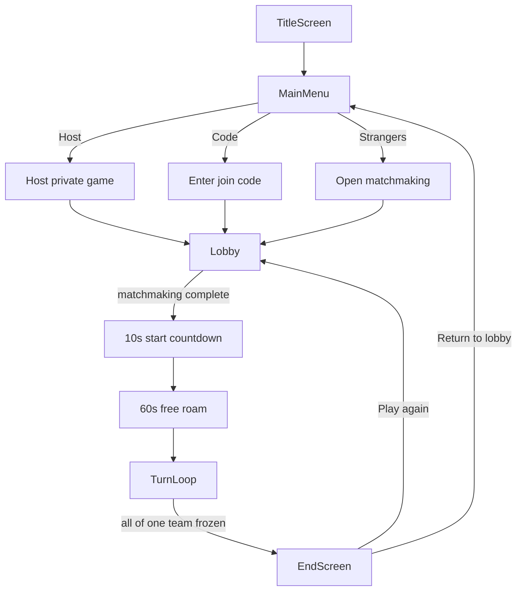
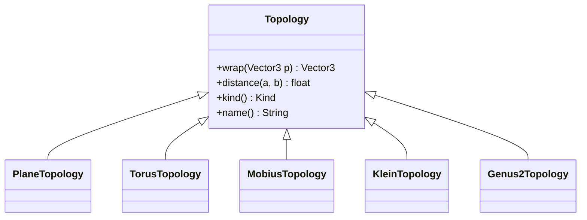
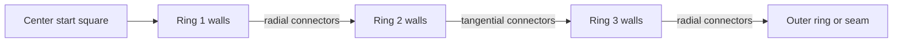
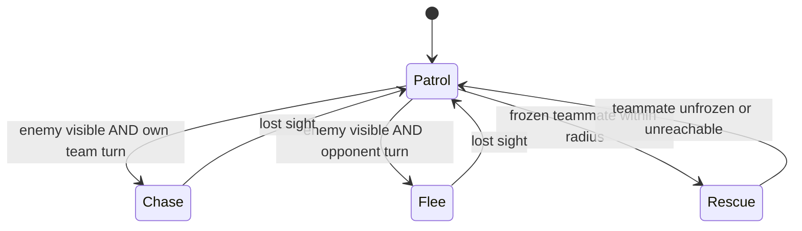
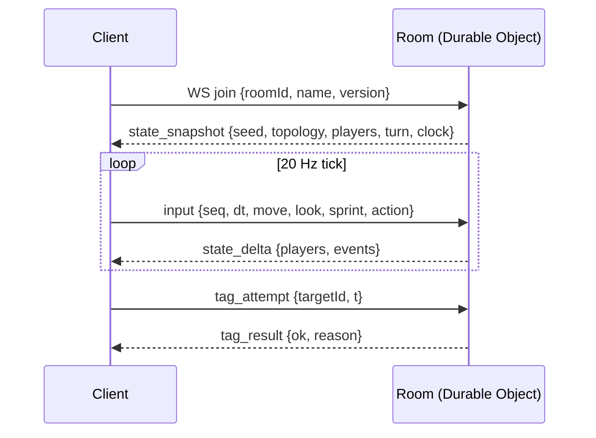
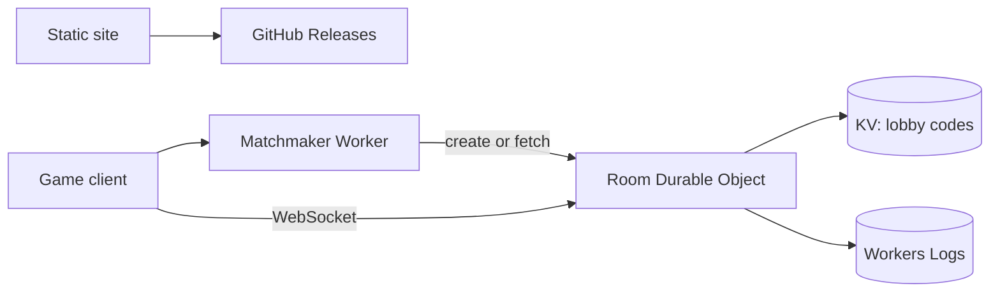
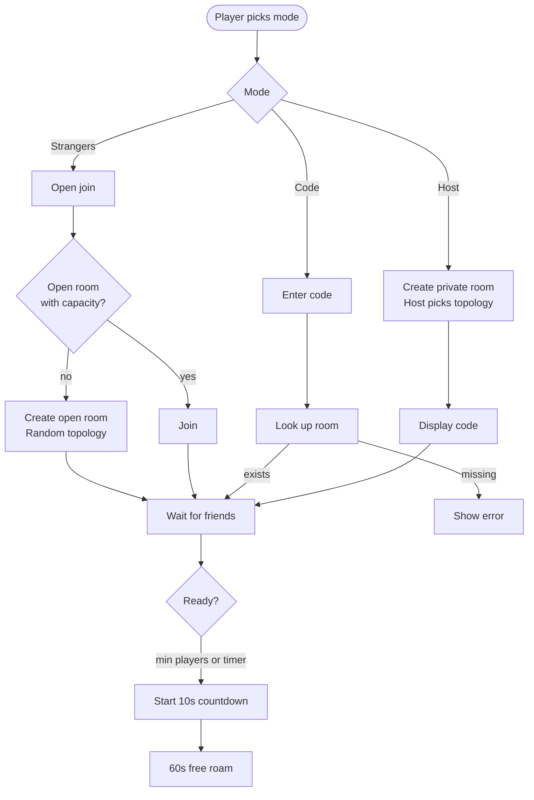
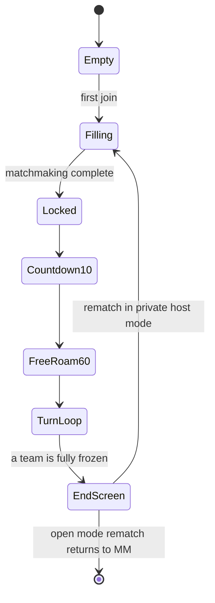
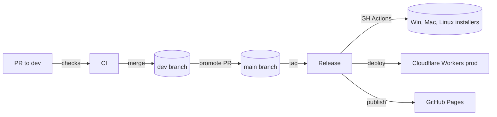

# Architecture

This document is the single source of truth for how the project is built. Other docs are intentionally light and link here for depth.

## Table of contents

- [Goals and constraints](#goals-and-constraints)
- [Technology choices](#technology-choices)
- [Monorepo layout](#monorepo-layout)
- [Game client](#game-client)
- [Topology system](#topology-system)
- [Labyrinth generator](#labyrinth-generator)
- [Audio system](#audio-system)
- [Bot AI](#bot-ai)
- [Networking](#networking)
- [Backend services](#backend-services)
- [Matchmaking](#matchmaking)
- [Room lifecycle](#room-lifecycle)
- [Anti-cheat](#anti-cheat)
- [Website](#website)
- [Build and release pipeline](#build-and-release-pipeline)
- [Environments](#environments)
- [Observability](#observability)
- [Budget](#budget)
- [Open questions](#open-questions)

## Goals and constraints

The game is a 3D team tag game played by 4 to 16 players (humans and bots) on a labyrinth wrapped onto a finite plane, torus, Möbius strip, Klein bottle, or double torus. Visibility is intentionally limited. Audio is sparse.

Hard constraints from the project brief:

- Native cross-platform desktop binary. Equal visuals on Windows, macOS, and Linux.
- Installer ships from a website link. No terminal, no scripts, no build from source for end users.
- Backend hosted on Cloudflare. Static site on GitHub Pages.
- Total infrastructure cost under USD 500 per year.
- Open source, MIT license, monorepo on GitHub, conventional commits, atomic commits, PR workflow.
- Zero AI fingerprints anywhere in the project.

Performance budget per platform:

- Steady 60 FPS on a 2020-class laptop GPU at 1080p.
- Network tick rate of 20 Hz for gameplay messages.
- Round-trip latency tolerated up to 200 ms with client prediction.

## Technology choices

| Layer            | Choice                                        | Reason                                                                                                                                                 |
| ---------------- | --------------------------------------------- | ------------------------------------------------------------------------------------------------------------------------------------------------------ |
| Game engine      | Godot 4 (GDScript primary, C# optional later) | MIT licensed, no royalties, cross-platform desktop export with parity, mature 3D pipeline, small editor footprint, strong async networking primitives. |
| Game language    | GDScript                                      | Fast iteration, no compile step, first-class in Godot, sufficient performance for this game's load.                                                    |
| Backend runtime  | Cloudflare Workers + Durable Objects          | Globally distributed edge compute, native WebSocket hibernation API for low cost, integrated logging, no servers to operate.                           |
| Backend language | TypeScript                                    | Strict typing for protocol safety. Shared types between Workers and tooling.                                                                           |
| Static site      | Astro                                         | Ships zero JS by default, fast, simple, easy to publish to GitHub Pages.                                                                               |
| Test runtime     | Vitest (TS), GUT (Godot), Playwright (web)    | Modern, fast, well-supported.                                                                                                                          |
| CI/CD            | GitHub Actions                                | Free for public repos, mature ecosystem, native to GitHub.                                                                                             |
| Package manager  | pnpm with workspaces                          | Fast installs, disk-efficient, first-class workspace support.                                                                                          |

Alternatives considered:

- Unity: licensing risk and Mac/Linux quirks ruled it out for a small open source game.
- Unreal: oversized for this game's visual scope, large binaries.
- Bevy (Rust): exciting but young; risk to schedule for a multi-platform shipping game.
- Bun on Cloudflare: not yet a first-class Workers runtime.

## Monorepo layout

```
clowns-and-mimes/
  game/                      Godot 4 project
    scenes/                  .tscn files
    scripts/                 .gd files
    assets/                  textures, audio, fonts
    addons/                  vendored Godot plugins (GUT for tests)
    export_presets.cfg       not tracked; generated at build
    project.godot
  backend/
    matchmaker/              Cloudflare Worker entry for matchmaking
    room/                    Durable Object hosting one game room
    shared/                  protocol types shared by both
  website/                   Astro static site
  tests/
    e2e/                     Playwright + headless game smoke checks
  docs/                      Architecture and contributor docs
  .github/
    workflows/               CI and release pipelines
    ISSUE_TEMPLATE/
  pnpm-workspace.yaml
  package.json
  LICENSE
```

## Game client



The game client is structured around scene composition in Godot:

- `Main.tscn` is the root that swaps the active screen.
- `TitleScreen.tscn` plays the three-phase title animation and a short oompa loop.
- `MainMenu.tscn` shows host, code, and strangers options plus username entry.
- `Lobby.tscn` is the dim center square where players spawn and wait for matchmaking.
- `Arena.tscn` instantiates a topology scene and the labyrinth.
- `HUD.tscn` overlays sprint bar, countdown, team status, side log, and frozen overlay.

Player movement is handled by `PlayerController.gd`, a `CharacterBody3D` with:

- WASD for translational movement
- Mouse look with capture
- Shift to sprint while sprint energy is above zero
- Footstep sound emitter modulated by current speed
- Tag and unfreeze fire on contact: when the active turn's team brushes within 1.2 m of an eligible opponent or teammate, the interaction is sent to the rules engine. A 0.6 s cooldown per target prevents a single brush from double-triggering.

Sprint energy:

- 100 unit pool, 25 units per second drain while sprinting, 15 units per second regen otherwise.
- Sprint is unavailable while frozen.

## Topology system

The world is represented as a 2D coordinate grid with topology-specific wrapping rules applied to both physics and rendering. This avoids the cost of true curved-surface rendering while keeping the gameplay feel of unusual topology.



| Topology     | Wrap rule                                                                                                                                                                       | Visual seam treatment                                                                                                                      |
| ------------ | ------------------------------------------------------------------------------------------------------------------------------------------------------------------------------- | ------------------------------------------------------------------------------------------------------------------------------------------ |
| Plane        | No wrap. Hard walls at edges.                                                                                                                                                   | None.                                                                                                                                      |
| Torus        | X wraps at width, Z wraps at depth.                                                                                                                                             | Edge portals render the opposite side of the map.                                                                                          |
| Möbius strip | X wraps with vertical flip, Z is bounded by hard walls. Single boundary loop.                                                                                                   | Two edge portals (one per x-seam) render the strip mirrored across z, giving continuous geometry past the seam.                            |
| Klein bottle | X wraps with vertical flip, Z wraps with no flip.                                                                                                                               | Edge portals on X axis render an inverted copy.                                                                                            |
| Double torus | Regular octagon fundamental polygon with sides identified in pairs (`aba^-1b^-1cdc^-1d^-1`). Crossing a side teleports the player to the mate side with the parameter reversed. | The 8 octagon vertices all identify to a single cone point on the closed surface, giving the characteristic two-handle (genus 2) topology. |

Wrapping is enforced in `Topology.wrap` after every physics step. Both the GDScript and TypeScript implementations share the same canonical math; the GDScript build uses `fposmod` where TS uses the `((v + half) % width + width) % width` idiom, which produce identical values.

## Labyrinth generator

The labyrinth is symmetric to keep the topology fair. It uses concentric ring regions with alternating connector orientations.



Generation steps:

1. Pick a deterministic seed from the room id.
2. Place the center start square.
3. For each ring, place wall segments at fixed radii with rotational symmetry of order N.
4. Cut radial connectors in odd rings and tangential connectors in even rings, alternating.
5. Apply topology-specific projection.
6. Bake static meshes for the labyrinth at room start. Walls go up high enough that players cannot see past them. Floor and walls are dark gray.

The labyrinth is deterministic given the seed so server and clients agree on geometry without sending mesh data.

## Audio system

Three audio buses configured at runtime: Music, SFX, UI.

- Title screen plays the oompa main menu loop on the Music bus.
- During gameplay each player has an `AudioStreamPlayer3D` footstep emitter on the SFX bus. The pitch scales with current planar speed (silent below a threshold, ~1.0 for walking, up to ~1.6 for sprinting). Remote players use 3D attenuation so distant steps fade with distance.
- Win plays a maniacal laugh on SFX. Loss plays the womp-womp stinger.
- The arena dims the Music bus once the match ends so the stinger reads cleanly.
- `AssetPaths` is a thin loader that returns null when an asset file is absent, so the game runs without art and sound during development.

## Bot AI

Two implementations, one shape:

- **Client-side BotAI (offline play).** Attached to each bot Player as a `BotAI` node. State machine runs at 5 Hz. Path is recomputed each decision tick via `Labyrinth.find_path` (AStarGrid2D on the labyrinth's 80x80 grid). The bot aims at the next waypoint instead of straight at the target, falling back to direct steering when no path is found. The 4 states are Patrol, Chase, Flee, Rescue.
- **Server-side bot AI (stranger rooms).** Lives in the room Durable Object's `simulate` loop. When the first human joins a fresh room, a 3 second bot-fill timer schedules `fillBots` plus `startCountdown`. The tick then drives chase/flee/patrol decisions using the same shared rules state, calls `canTag` on contact, and broadcasts `tagged` events identical to the human path.



- Visibility: scalar distance threshold against the topology-aware `distance` function. No raycast cone yet.
- Topology-aware A\* across the torus and Klein seam is tracked as a follow-up: currently the grid is flat and the bot walks the long way around when it should cross a seam.
- Server-side bots ignore wall geometry (the labyrinth is generated client-side from a seed). Porting the wall generator to TS so the room can run authoritative collision is tracked as a follow-up.

## Networking

Server-authoritative on the freeze state. Movement is client-predicted with server reconciliation.



Wire protocol is JSON over WebSocket with a `t` discriminator field on every message, and `PROTOCOL_VERSION = 1` (defined in `@cm/shared/protocol`). The room rejects mismatched versions with a `version_mismatch` error and closes the socket.

Message types: `join`, `leave`, `input`, `snapshot`, `delta`, `event`, `tag_attempt`, `tag_result`, `unfreeze_attempt`, `unfreeze_result`, `ping`, `pong`, `error`.

Reconciliation:

- Client streams inputs at 20 Hz with a monotonically increasing seq.
- Server's `delta` returns an `ackSeq` plus authoritative player states.
- Today the client snaps remote player positions and keeps the local player's predicted position; full re-simulation from the last acked input is a follow-up.

Interest management is light. Rooms cap at 16 players, the full state fits in a small packet.

Client modules:

- `ServerConfig` reads `CLOWNS_MM_URL` from the OS environment first, then a project setting, then falls back to the production matchmaker.
- `MatchmakerClient` issues the three HTTP calls (create private, join code, open join) and emits signals with the parsed responses.
- `RoomClient` owns the WebSocket lifecycle, sends `join`/`input`/`tag_attempt`/`unfreeze_attempt`/`ping`, and emits parsed `snapshot`/`delta`/`event`/`error` signals. Arena consumes those when `GameState.server_url` is set; otherwise the offline rules engine drives the match.

## Backend services



- `matchmaker` Worker exposes:
  - `POST /lobby` creates a private room and returns `{code, roomId, wsUrl}`. The code is written to KV with a 6 hour TTL.
  - `POST /lobby/{code}/join` reads the KV entry and returns `{roomId, wsUrl}`.
  - `POST /open/join` lists open-room entries by prefix, picks the most populated one under the soft capacity (12), increments its joined counter, and returns its `wsUrl`. Falls back to spinning up a fresh open room with a random topology when no candidate exists.
  - `GET /healthz` for uptime checks.
- `wsUrl` is composed as `wss://<room-worker-name>.<account-subdomain>.workers.dev/ws/{roomId}` where `<account-subdomain>` is the account's `*.workers.dev` slug, provided to the matchmaker as the `WORKERS_SUBDOMAIN` env var.
- `room` Durable Object holds room state, broadcasts deltas, drives the 20 Hz tick loop, and runs server-side bot AI in stranger rooms. Uses the WebSocket hibernation API to stay cheap when idle.
- `shared` provides protocol types and topology helpers compiled into both Workers via subpath exports (`@cm/shared`, `@cm/shared/topology`).

## Matchmaking



Open rooms target a soft capacity of 12 humans before opening a fresh room. Once a human joins, the room schedules a 3 second bot-fill timer; when it fires the room fills empty seats up to 4 bots per team and starts the 10 second countdown, so a solo player never sits in an empty lobby.

## Room lifecycle



Turn duration progression: round 1 is 30 seconds per team, round 2 is 60 seconds, round 3 is 90 seconds, then +30 each round, capped at 5 minutes.

## Anti-cheat

- All state transitions are server-authoritative.
- The server validates tag attempts: distance under threshold, both players alive, attacker not frozen, attacker on the active turn team.
- Movement deltas exceeding the maximum sprint speed are clamped.
- Clients connect with a build version and a session token derived from the room code. Mismatched versions are rejected with a clear error.

We do not attempt binary anti-tamper. The blast radius of cheating is limited because the server is the source of truth.

## Website

A small Astro site at `website/` deployed to GitHub Pages on every push to `main`.

Pages:

- Home: title, screenshot, install buttons that detect the visitor's OS.
- How to play: rules summary.
- Topologies: short visual explainer for each.
- Credits: assets and acknowledgements.

The install buttons resolve to the latest GitHub release asset by platform using a small client-side fetch against the GitHub API at runtime, with a static fallback.

## Build and release pipeline



CI on every PR runs:

- Lint and format
- Type check
- Unit tests
- Backend integration tests against a Miniflare instance
- Game headless smoke tests via Godot in headless mode
- Build verification of game, backend, and website
- Playwright website tests
- Dependency vulnerability audit

Release on a `v*` tag:

- Build game for Windows, macOS, and Linux in parallel jobs.
- Sign macOS build if signing secrets are configured.
- Publish artifacts to GitHub Releases.
- Deploy `backend/*` to the matching Workers environment.
- Deploy website to GitHub Pages.

## Environments

| Environment | Branch | Backend                                  | Frontend                   |
| ----------- | ------ | ---------------------------------------- | -------------------------- |
| dev         | `dev`  | `cm-matchmaker-dev.seanreid.workers.dev` | preview deploy on every PR |
| production  | `main` | `cm-matchmaker.seanreid.workers.dev`     | GitHub Pages               |

Each environment has its own KV namespace and Durable Object class binding to keep state isolated. Per-PR preview deploys cover the pre-prod sanity check role a staging branch used to handle.

## Observability

- Cloudflare Workers Logs for backend events and errors.
- Lightweight structured logs from the room over `console.log` with a JSON shape so they parse cleanly in Workers Logs.
- `tests/smoke` is a single-file TS script that hits a deployed matchmaker end-to-end (healthz, create lobby, join by code, websocket snapshot). Run via `pnpm --filter @cm/smoke dev` against the dev backend or `pnpm --filter @cm/smoke production` against prod. Useful as a manual deploy verification.
- `scripts/playtest-dev.sh` launches the Godot editor with `CLOWNS_MM_URL` pointed at the dev workers so a maintainer can play the editor build against the live dev backend instead of offline bots.

No third-party error tracker is wired up. Adding one is a future consideration; current scale does not require it.

## Budget

| Item                                                         | Annual cost               |
| ------------------------------------------------------------ | ------------------------- |
| Cloudflare Workers Paid plan                                 | USD 60                    |
| Apple Developer Program (for macOS signing and notarization) | USD 99                    |
| Domain registration (optional, deferrable)                   | USD 15                    |
| GitHub (public repo, free)                                   | USD 0                     |
| **Total**                                                    | **USD 174** with headroom |

Initial release can ship without code signing on macOS by accepting Gatekeeper warnings. Notarization is a fast-follow.

## Open questions

- Final username generator dictionary needs curation. The first cut is a small adjective-and-noun list expanded in a follow-up.
- Double torus rendering: the playfield is a flat octagon with identifications; whether to add a visible "wraparound preview" along each side seam (similar to the torus / Klein edge portals) is a design question after the geometry settles.
- Whether to support cosmetic skins beyond clown and mime in v1. Default answer: no, scope creep.
